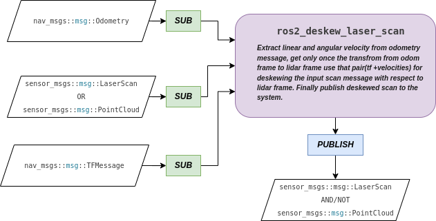
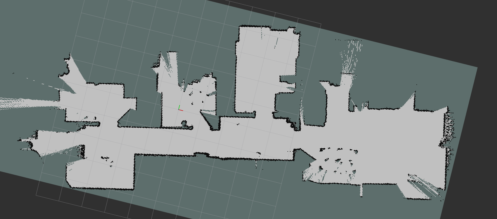
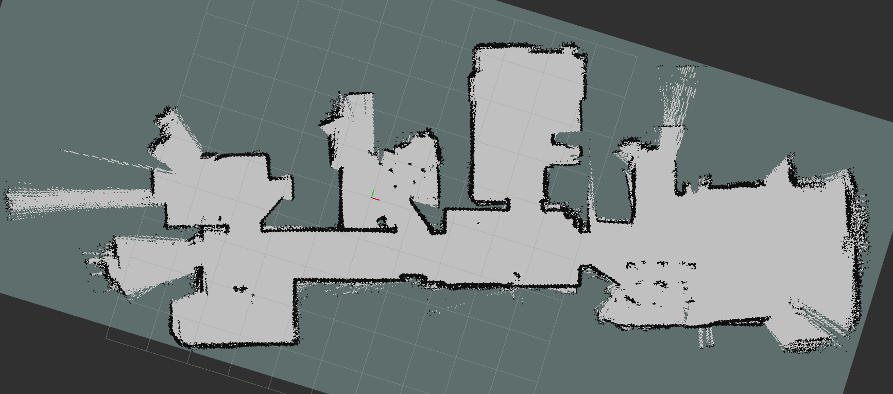

# Laser Scan Deskew ROS2

Package for deskew rotating 2-D lidars scan on mobile platforms based on velocity of the platform. Tested on a diff-dirve platform with odometry and scan message. Used Ydlidar X4 for the results below but probably gona work well with ydlidar G1, G2, G6, GS2, TEA, TG, TminiPro.yaml, X2.yaml and X4-pro.yaml. Results are with the official [*ydlidar_ros2_driver*](https://github.com/YDLIDAR/ydlidar_ros2_driver/tree/humble) but there is no reason why it won't work with other brand devices, we look forward to your feedback on other devices than ydlidar.

## Sysytem Diyagram

    

## Resluts

Maps are generated with same bag 5x faster than real-time only with switching the scan topic. Used mapping package [*salam-toolbox*](https://github.com/SteveMacenski/slam_toolbox/tree/ros2).

### With Deskewing

    

### Without Deskewing

    

### Green Scan Deskewed

The first picture in red scan we can obviously see that walls that should be parallel are far away from that shape, but thanks to deskew it can be corrected.
The second picture in red scan we can obviously see that walls that should be straight (right below corner) are far away from that shape, but thanks to deskew it can be corrected.

    
    

